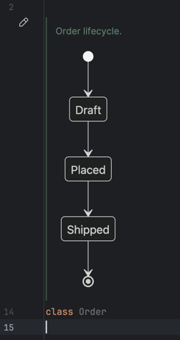

# Mermaid Renderer

[](https://github.com/tvcsantos/jetbrains-mermaid-renderer/actions/workflows/build.yml)

An IntelliJ plugin that renders [Mermaid](https://mermaid.js.org) diagrams inside the IDE's
**Rendered Documentation Comments**.

Write a diagram in a KDoc or Javadoc comment:

````kotlin
/**
 * Order lifecycle.
 *
 * ```mermaid
 * stateDiagram-v2
 *     [*] --> Draft
 *     Draft --> Placed
 *     Placed --> Shipped
 *     Shipped --> [*]
 * ```
 */
class Order
````

Toggle the rendered view (the gutter icon, or <kbd>Ctrl</kbd>+<kbd>Alt</kbd>+<kbd>Q</kbd>) and the
code block is replaced by the diagram. The same happens in the quick documentation popup, on hover
and in the documentation tool window.

It will look like this:



## How it works

- The plugin does not compete for ownership of a comment's documentation. It replaces the two
  platform services the finished HTML passes through: `DocRendererProvider` for rendered comments,
  and `IdeDocumentationTargetProvider` for the popup, hover and tool window. Both are marked
  `open="true"` by the platform for exactly this purpose, and every request funnels through them,
  so nothing depends on extension ordering and no language-specific code is needed: any language
  whose documentation HTML contains a Mermaid block works. A service has a single owner, so a
  startup check reports it when another plugin takes one of the two over.
- Diagrams are rendered locally: a bundled `mermaid.min.js` runs in an offscreen JCEF browser,
  which draws the resulting SVG onto a canvas and returns PNG bytes. **No network access and no
  external tools.**
- Rendered PNGs are cached on disk, so reopening a file shows diagrams instantly.
- Rendering never blocks the documentation, which is produced under a read lock: a block whose
  diagram is not ready is left as written, and the comment is refreshed as soon as the image is.

## Detection

A code block is treated as Mermaid when it is tagged - ` ```mermaid ` in KDoc or Markdown Javadoc,
`<pre class="mermaid">` in HTML Javadoc - or, when the heuristic is enabled (default), when it
starts with a Mermaid keyword such as `graph`, `flowchart`, `sequenceDiagram`, `classDiagram`,
`stateDiagram`, `erDiagram`, `gantt` or `mindmap`.

## Settings

**Settings | Tools | Mermaid Renderer**:

- **Heuristic detection** of untagged blocks (on by default).
- **A gutter icon for diagrams that fail to render** (off by default).
- **A placeholder while a diagram is rendering** (off by default).
- Diagram theme (follows the IDE theme by default), maximum width, render timeout, disk cache limit,
  and a button to clear the cache.

A diagram Mermaid cannot parse never appears in the documentation itself: the comment keeps the code
block as written, and the error goes to the IDE log. Turn the gutter icon on to see it beside the
declaration as well, where hovering shows the message and clicking shows the full text.

## Building

```bash
./gradlew build          # compile, test, verify
./gradlew runIde         # sandbox IDE with the plugin installed
./gradlew buildPlugin    # distributable ZIP in build/distributions
```

Requires JDK 21. The plugin targets IntelliJ IDEA 2026.2 (build 262) and newer.

Every push and pull request runs `./gradlew build verifyPlugin` on GitHub Actions, and the resulting
ZIP is attached to the run as an artifact.

## Releasing

Set `pluginVersion` in `gradle.properties`, then push the matching tag:

```bash
git tag v0.1.0 && git push origin v0.1.0
```

The release workflow refuses a tag that does not match `pluginVersion`, builds and verifies the
plugin, and attaches the ZIP to a GitHub release. Two further steps run only when their repository
secrets exist, so the workflow is usable before either is set up:

| Secret                                                     | Effect                                                                                                       |
|------------------------------------------------------------|--------------------------------------------------------------------------------------------------------------|
| `CERTIFICATE_CHAIN`, `PRIVATE_KEY`, `PRIVATE_KEY_PASSWORD` | The plugin is signed. See [Plugin Signing](https://plugins.jetbrains.com/docs/intellij/plugin-signing.html). |
| `PUBLISH_TOKEN`                                            | The plugin is published to JetBrains Marketplace.                                                            |

A `pluginVersion` such as `0.2.0-beta.1` publishes to the `beta` channel instead of the default one.

## License

This project is licensed under the MIT License. See [LICENSE](LICENSE).

It bundles `mermaid.min.js`, also MIT, whose license is kept in
`src/main/resources/mermaid/LICENSE-mermaid.txt`.
